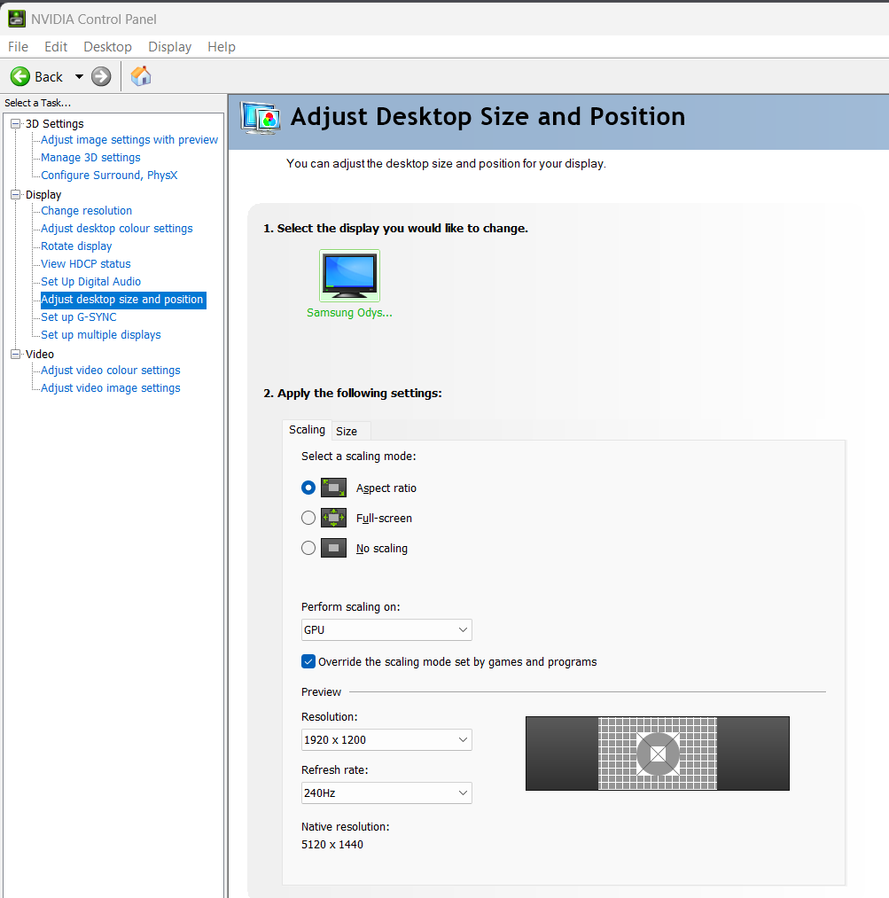

# NV_Modes Persistence Tool

> Auto-restores custom resolutions on Samsung Odyssey OLED G9 (and other DSC-locked monitors) after every NVIDIA driver update. Set it once, forget about it.

[](https://buymeacoffee.com/izu_x)

## Install

**1. Get the files.** Clone or download this repo to a stable location — Task Scheduler stores absolute paths, so don't leave it in `Downloads`.

```powershell
git clone https://github.com/izu-x/OdysseyG9NvidiaCustomResolutions.git C:\Tools\NvModes
cd C:\Tools\NvModes
```

**2. Configure NVIDIA Control Panel — one-time.** Without this, custom resolutions either won't appear, will run at reduced refresh, or will lose Adaptive Sync.



*Adjust desktop size and position* → select the G9:

- **Select a scaling mode:** `Aspect ratio`
- **Perform scaling on:** `GPU`
- ✅ *Override the scaling mode set by games and programs*
- **Apply**

> The GPU upscales the custom resolution to fill the panel height while preserving aspect ratio (black bars on the sides only). The monitor still receives a native 5120×1440 @ 240 Hz signal, so DSC stays happy.
>
> If `Aspect ratio` causes VRR/G-Sync issues at custom resolutions, switch to `No scaling` (sends the timing as-is, panel centers a smaller image with borders on all sides).

**3. Add your resolutions and install the scheduled task.** Open PowerShell **as Administrator**:

```powershell
Set-ExecutionPolicy -Scope Process Bypass

.\Set-NvModes.ps1 -Add 2304x1440      # add as many as you want
.\Set-NvModes.ps1 -Install            # registers SYSTEM scheduled task
```

Reboot. Done — the resolutions appear in NVIDIA Control Panel and survive every driver update.

## Managing resolutions

```powershell
.\Set-NvModes.ps1 -Add 3440x1440      # append + apply
.\Set-NvModes.ps1 -Remove 2304x1440   # remove + apply
.\Set-NvModes.ps1 -List               # show live NV_Modes + configured customs
.\Set-NvModes.ps1                     # interactive menu (list/add/remove/etc.)
```

The tool stores customs in `custom-resolutions.txt` (gitignored). One entry per line:

```text
# WxH (default mask 1FFF)
2304x1440

# Or explicit mask
2560x1440x8,16,32,64=1FFF
```

## Why

DSC-locked monitors at 240 Hz (G9 OLED — G93SC / G93SD / G95SC, Neo G9, similar) hit a wall:

- CRU's custom resolutions never appear in NVIDIA Control Panel.
- NVCP's *Customize…* button is greyed out.
- The only working path is editing `NV_Modes` in the registry.
- **Every driver update wipes it.**

This tool automates the persistence and gives you a clean CLI so you never hand-edit a 1000-character registry string.

## How it works

`NV_Modes` is a registry string the NVIDIA driver reads at init. Adding entries forces NVCP to expose extra resolutions even when EDID/DisplayID doesn't.

The catch: the value lives at a path like

```text
HKLM\SYSTEM\CurrentControlSet\Control\Class\{4d36e968-e325-11ce-bfc1-08002be10318}\0000
```

The `\0000` suffix is **not stable** — it shifts to `\0001`, `\0002`, etc. after a DDU run, GPU swap, or Windows feature update. Static `.reg` files break silently when this happens.

The script:

1. Walks every subkey under the display class and filters by `DriverDesc` matching your NVIDIA GPU.
2. Reads the live `NV_Modes`, strips entries listed in `custom-resolutions.txt`, re-appends them, writes back.
3. Skips the write if the value is already current (Task Scheduler-safe — no backup spam).
4. Auto-exports a `.reg` backup before every change. Keeps the last 20.

`-Install` registers a SYSTEM-level scheduled task that runs `-Apply` on system startup, workstation unlock, and `Display` event ID 1 (driver re-init).

## Reference

| Command | Action |
| --- | --- |
| `.\Set-NvModes.ps1` | Interactive menu |
| `.\Set-NvModes.ps1 -List` | Show live `NV_Modes` + configured customs |
| `.\Set-NvModes.ps1 -Add WxH` | Append resolution and apply |
| `.\Set-NvModes.ps1 -Remove WxH` | Drop resolution and apply |
| `.\Set-NvModes.ps1 -Apply` | Re-write `NV_Modes` from config (idempotent) |
| `.\Set-NvModes.ps1 -Backup` | Export current `NV_Modes` to `backups\*.reg` |
| `.\Set-NvModes.ps1 -Restore <file>` | Restore from a backup |
| `.\Set-NvModes.ps1 -Install` | Register scheduled task |
| `.\Set-NvModes.ps1 -Uninstall` | Remove scheduled task |

| Parameter | Default | Purpose |
| --- | --- | --- |
| `-GpuMatch` | `*NVIDIA*` | `DriverDesc` wildcard. Narrow with `*RTX 4090*` for multi-GPU |
| `-ConfigPath` | `.\custom-resolutions.txt` | Custom resolutions file |
| `-BackupDir` | `.\backups` | Where `.reg` exports go |
| `-KeepBackups` | `20` | Max backups retained |
| `-TaskName` | `NV_Modes Persistence` | Scheduled task name |

## Uninstall

```powershell
.\Set-NvModes.ps1 -Uninstall
.\Set-NvModes.ps1 -Restore .\backups\<earliest>.reg
```

Then reboot.

## Prior art

- [u/SpaghettiDuders](https://www.reddit.com/r/ultrawidemasterrace/comments/r6r4na/g9_3440x14402560x1439_240hz_gsync_workaround_part/) — original Reddit workaround documenting the `NV_Modes` + NVCP scaling combo.
- [JoshKeegan/OdysseyG9NvidiaResolutionFix](https://github.com/JoshKeegan/OdysseyG9NvidiaResolutionFix) — Go CLI for the original VA Neo G9. Predates the OLED line, requires manual re-run after driver updates.
- [ToastyX](https://www.monitortests.com/forum/Thread-Custom-Resolutions-with-the-Samsung-G9-and-nVidia) — diagnosis of the underlying CRU / DisplayID 2.0 / DSC limitation, and [CRU](https://www.monitortests.com/forum/Thread-Custom-Resolution-Utility-CRU) itself.

## Disclaimer

Modifies the Windows registry under the display adapter class. Reversible — the script auto-backs up before each write; restore via `-Restore`. Not affiliated with NVIDIA, Samsung, or ToastyX.

## License

MIT — do whatever, no warranty.
